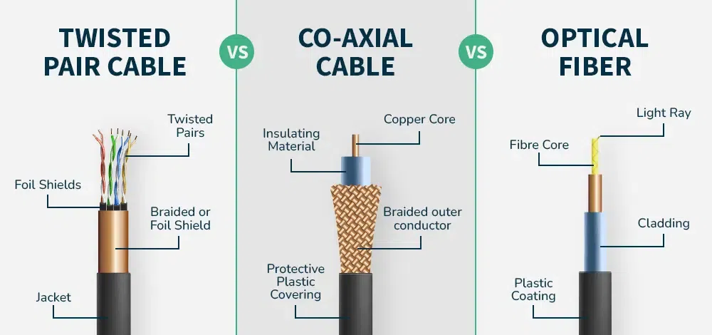

# 📡 **4. Network Cable Evolution**  
**Coaxial → BNC T-Connector → UTP → CAT → Fiber Optic**  
{#network-cable}

*Image: Coaxial, UTP, CAT, and Fiber Optic Cables (Sample Placeholder)*

## ⭐ How Did Networking Cables Evolve?
Believe it or not, the internet did **not** start with Wi-Fi.  
The journey of network cables is actually a story of *speed, creativity, and clever engineering*.

Here’s the fun timeline:

### 🟡 **1. Coaxial Cable – The Old-School Classic**
Thick, tough, and used with BNC T-connectors.  
This was the “vintage internet” used in early LANs.

### 🔵 **2. UTP (Twisted Pair) – The Flexible Favorite**
Engineers twisted the wires to reduce interference — simple idea, big improvement!

### 🟢 **3. CAT Cables – Getting Faster Every Generation**
- **CAT3 → CAT5 → CAT5e → CAT6 → CAT6a → CAT7/8**  
Each upgrade brought more speed, better quality, and more reliability.

### 🔴 **4. Fiber Optic – The Speed of Light**
Literally.  
Instead of electricity, fiber-optic cables use **light**, allowing:
- Super-high speeds  
- Long distances  
- Zero interference  

This is what powers modern internet backbones.

---

## ⭐ Why It Matters
Every message you send, every class you attend online, and every game you play touches these cables at some point.

They’re the **invisible heroes** of the internet.

