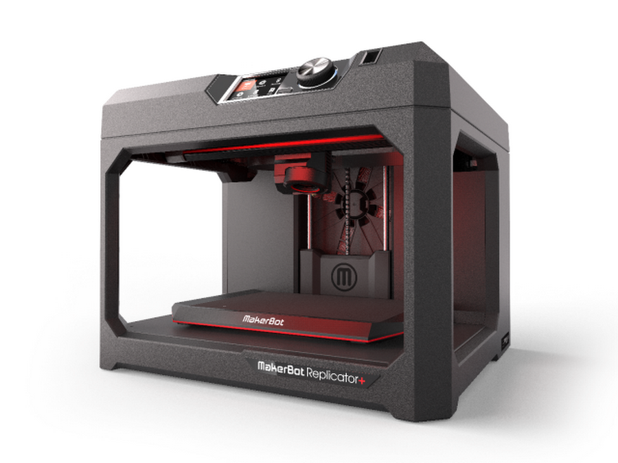
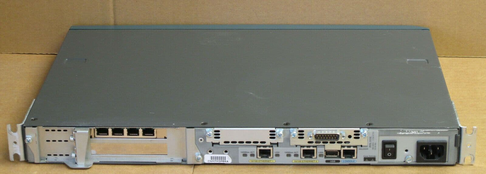
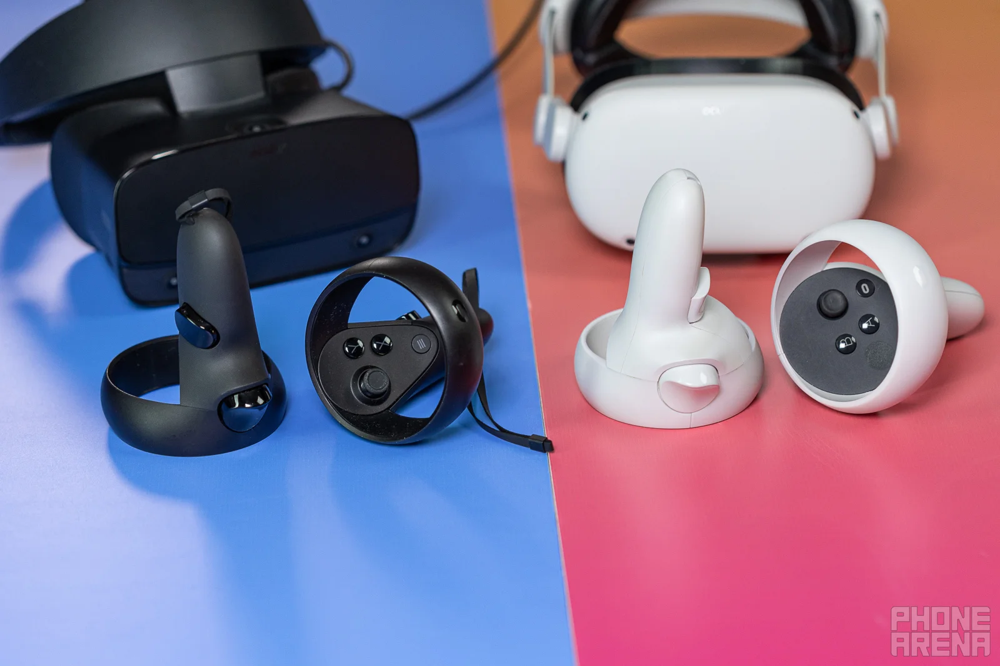

# 🔧 TechXpo 2025 – Hardware & Technology Showcase
Welcome to the official showcase for the hardware and technology items at **TechXpo 2025**.  
Scan the QR code at each display to jump directly to its section below.

---

<!-- ========================= -->
<!-- 🎯 1. 3D PRINTER -->
<!-- ========================= -->

# 🖨️ **1. 3D Printer – MakerBot Replicator**

  
    <em>Image: MakerBot Replicator</em>

## ⭐ What Is a 3D Printer?
A 3D printer is a machine that can **create real, physical objects** by building them **layer by layer** from melted plastic.  
It works almost like a hot-glue gun that a computer controls with extreme precision.

## ⭐ Why It Matters
3D printing is transforming how we design, build, and experiment.  
Students, engineers, artists — anyone can turn an idea into a real object within hours.

## ⭐ How the MakerBot Replicator Works
- Loads a spool of plastic (called **filament**)  
- Heats it until it melts  
- Follows a digital design  
- Builds the object **one thin layer at a time**  

This process is called **additive manufacturing**, because the machine *adds* material to create shapes.

## ⭐ Cool Things You Can Make
- Phone stands  
- Keychains  
- Prototypes and models  
- Art pieces and miniatures  
- Custom replacement parts  

## ⭐ Why It's Important for Students  
3D printing encourages:
- Creativity  
- Hands-on problem solving  
- Engineering thinking  
- Rapid experimentation  

It gives students the power to **design something and see it become real**, an exciting experience for anyone, regardless of major.

----

<!-- ========================= -->
<!-- 🎯 2. NETWORK SWITCH -->
<!-- ========================= -->

# 🔀 **2. Network Switch – Cisco Catalyst 2950s**

  
    <em>Image: Cisco Catalyst 2960s</em>

## ⭐ What Is a Network Switch?
A network switch acts like a **traffic director** for devices in a building.  
It connects computers, printers, and servers — making sure every piece of data reaches the right place quickly and safely.

If Wi-Fi is the “air,” the switch is the **heart of the wired network**.

## ⭐ Why Switches Matter
- Keep data organized  
- Provide fast, stable connections  
- Improve security  
- Allow large networks to run smoothly  

---

## ⭐ Enterprise vs Consumer Switches  
### 🏠 **Home Switch**
- Simple  
- Handles a few devices  
- Limited features  

### 🏢 **Enterprise Switch**
- Supports many devices  
- Strong security  
- VLANs & traffic control  
- Designed to run 24/7  

The Cisco Catalyst 2950s is an **enterprise-grade switch** used in universities and businesses.

---

## ⭐ How It Works (Simple Example)
Imagine a busy hallway.  
Each student (device) wants to deliver a message to a classroom.

The switch is the **helper** who:
- Knows every classroom  
- Delivers messages without mixing them up  
- Prevents traffic jams  

---

## ⭐ Why Students Should Care
Every online activity — from Canvas to Netflix — depends on switches.  
Understanding them shows how real-world networks stay connected.
---

<!-- ========================= -->
<!-- 🎯 3. FIREWALL -->
<!-- ========================= -->

# 🔥 **3. Network Firewall – Cisco PIX 515e**

  
    <em>Image: Cisco PIX 515e</em>

## ⭐ What Is a Firewall?
A firewall is a **security guard for a computer network**.  
It watches all incoming and outgoing traffic and decides what is safe and what should be blocked.

If the network is a building, the firewall is the **main door with a trained guard** checking everyone who tries to enter.

## ⭐ Why Firewalls Matter
- They protect organizations from hackers  
- They block suspicious or harmful traffic  
- They keep sensitive information safe  
- They are the first major defense for any network  

Without a firewall, a company’s systems would be wide open to attacks.

---

## ⭐ How the Cisco PIX 515e Works
- Filters traffic based on rules  
- Stops unauthorized access  
- Monitors connections using stateful inspection  
- Protects different parts of the network  

It was widely used in businesses, schools, and government systems as a reliable security device.

---

## ⭐ Easy Example  
Imagine you’re hosting a party:

- **Invited friends** = allowed traffic  
- **Random strangers** = blocked  
- **Suspicious behavior** = flagged and stopped  

That’s exactly what a firewall does — it keeps the good in and the bad out.

---

## ⭐ Why It’s Important for Students  
Firewalls are the foundation of **cybersecurity**.  
Understanding them helps you appreciate how your university, workplace, and even your home stay safe online.
---

<!-- ========================= -->
<!-- 🎯 4. NETWORK CABLE EVOLUTION -->
<!-- ========================= -->

# 📡 **4. Network Cable Evolution**  
**Coaxial → BNC T-Connector → UTP → CAT → Fiber Optic**

  
    <em>Image: Coaxial, UTP, CAT, and Fiber Optic Cables</em>

## ⭐ How Did Networking Cables Evolve?
Believe it or not, the internet did **not** start with Wi-Fi.  
The journey of network cables is actually a story of *speed, creativity, and clever engineering*.

Here’s the fun timeline:

### 🟡 **1. Coaxial Cable – The Old-School Classic**
Thick, tough, and used with BNC T-connectors.  
This was the “vintage internet” used in early LANs.

### 🔵 **2. UTP (Twisted Pair) – The Flexible Favorite**
Engineers twisted the wires to reduce interference — simple idea, big improvement!

### 🟢 **3. CAT Cables – Getting Faster Every Generation**
- **CAT3 → CAT5 → CAT5e → CAT6 → CAT6a → CAT7/8**  
Each upgrade brought more speed, better quality, and more reliability.

### 🔴 **4. Fiber Optic – The Speed of Light**
Literally.  
Instead of electricity, fiber-optic cables use **light**, allowing:
- Super-high speeds  
- Long distances  
- Zero interference  

This is what powers modern internet backbones.

---

## ⭐ Why It Matters
Every message you send, every class you attend online, and every game you play touches these cables at some point.

They’re the **invisible heroes** of the internet.

--- 

<!-- ========================= -->
<!-- 🎯 5. STORAGE -->
<!-- ========================= -->

# 💾 **5. Storage Unit – IBM Magnetic Tape, Floppy Disk, Exabyte Cartridges**

  
    <em>Image: Magnetic Tape Reels, Floppy Disks, Tape Cartridges</em>

## ⭐ A Quick Trip Through Storage History
Before USB drives or cloud storage, computers stored data in some *surprisingly creative* ways.  
Here’s how storage technology evolved over the years:

### 🎞️ **1. Magnetic Tape Reels – The Giants of Early Computing**
Huge reels used by IBM mainframes.  
Slow, but could hold a *lot* of data for the time.

### 📼 **2. Tape Cartridges – Smaller, Smarter, More Organized**
Formats like **Exabyte** packed more data into portable cartridges.  
Still used today for large archival backups.

### 💿 **3. Floppy Disks – The ’80s & ’90s Icon**
Portable, easy to use, and perfect for documents.  
Sizes included:
- 8-inch  
- 5.25-inch  
- 3.5-inch (the one everyone remembers!)

### ☁️ **4. Transition to Early Digital Media**
These older formats paved the way for:
- CDs  
- USB drives  
- SSDs  
- And now… cloud storage  

---

## ⭐ Why It’s Cool
Storage evolution shows how fast technology changes —  
what once required a *refrigerator-sized* machine now fits on a *tiny microchip*.

It’s a perfect reminder of how far computing has come.

--- 

<!-- ========================= -->
<!-- 🎯 6. VR TECHNOLOGY -->
<!-- ========================= -->

  
  <em>VR Headsets</em>

## ⭐ What Is Virtual Reality (VR)?
Virtual Reality allows you to **step inside a digital world** instead of just looking at a screen.  
Put on the headset, and suddenly you’re standing in a virtual lab, a new city, a game world — anywhere.

It’s one of the most immersive technologies ever created.

---

## ⭐ How VR Actually Works
VR combines:
- **Head tracking** – the scene moves when you move  
- **Hand controllers** – to grab, point, and interact  
- **3D visuals** – one screen per eye for depth  
- **Spatial audio** – sound coming from correct directions  

Together, these tricks convince your brain that the virtual world is *real*.

---

## ⭐ Why VR Matters
VR is not just for gaming — it’s changing many fields:

### 🎓 Education  
Students can explore molecules, ancient history, engineering models, and more.

### 🏥 Healthcare  
Doctors train for surgeries in realistic simulations.

### 🏭 Industry  
Workers practice operating machinery safely in VR.

### 🎨 Creativity  
Artists can sculpt or paint in 3D space.

VR transforms learning, training, creativity, and entertainment.

---

## ⭐ Why Students Love It
It’s fun, interactive, and unforgettable.  
VR lets you **experience** things instead of just reading about them.

It’s learning — but upgraded.

---

Thanks for exploring the TechXpo 2025 Hardware Showcase!
