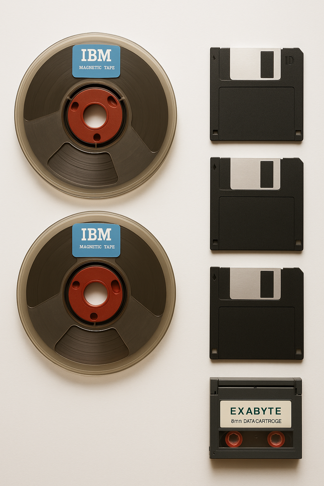

# 💾 **5. Storage Unit – IBM Magnetic Tape, Floppy Disk, Exabyte Tape Cartridges** {#storage-unit}

*Image: Magnetic Tape Reels, Floppy Disks, Tape Cartridges (Sample Placeholder)*

## ⭐ A Quick Trip Through Storage History
Before USB drives or cloud storage, computers stored data in some *surprisingly creative* ways.  
Here’s how storage technology evolved over the years:

### 🎞️ **1. Magnetic Tape Reels – The Giants of Early Computing**
Huge reels used by IBM mainframes.  
Slow, but could hold a *lot* of data for the time.

### 📼 **2. Tape Cartridges – Smaller, Smarter, More Organized**
Formats like **Exabyte** packed more data into portable cartridges.  
Still used today for large archival backups.

### 💿 **3. Floppy Disks – The ’80s & ’90s Icon**
Portable, easy to use, and perfect for documents.  
Sizes included:
- 8-inch  
- 5.25-inch  
- 3.5-inch (the one everyone remembers!)

### ☁️ **4. Transition to Early Digital Media**
These older formats paved the way for:
- CDs  
- USB drives  
- SSDs  
- And now… cloud storage  

---

## ⭐ Why It’s Cool
Storage evolution shows how fast technology changes —  
what once required a *refrigerator-sized* machine now fits on a *tiny microchip*.

It’s a perfect reminder of how far computing has come.

